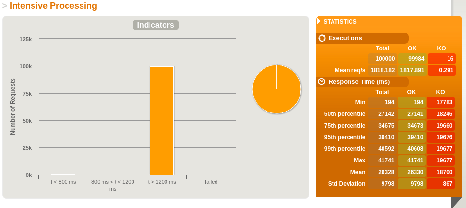
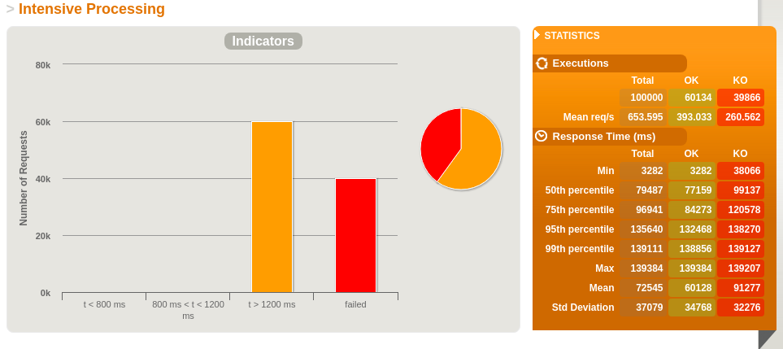
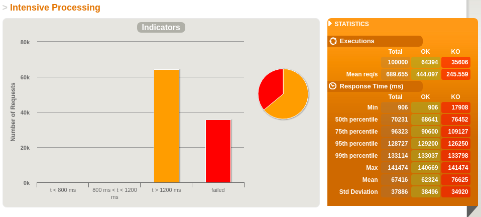
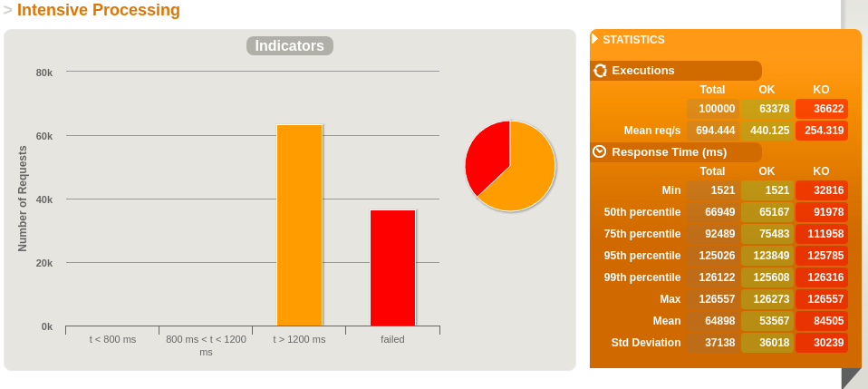
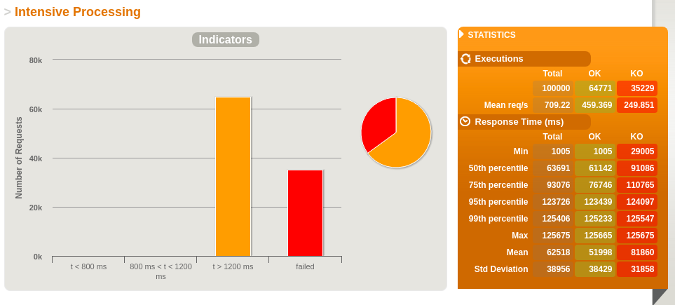

# Web Frameworks final countdown!
> POCs with benchmark

A lot of stress test hitting all the API's with [Gatling](https://gatling.io/) for 100.000 simultaneous hits.
Bellow, the results.

## Micronaut

## Finatra

## Spring boot 2.0 with Webflux

## Spring boot 2.0

## Camel Rest DSL

## Partial result

[Micronaut](http://micronaut.io/)

## Roadmap

* Add docker container to every app
* Set JVM memory limit
* Add other languages frameworks

## Meta

Alex Rocha - [about.me](http://about.me/alex.rochas)
